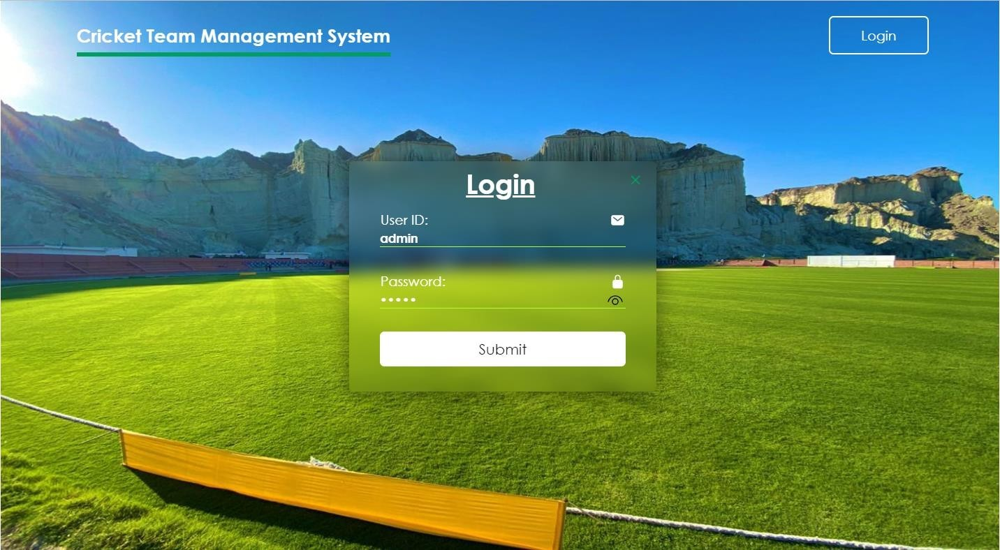
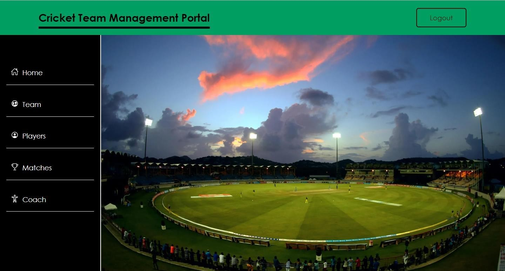
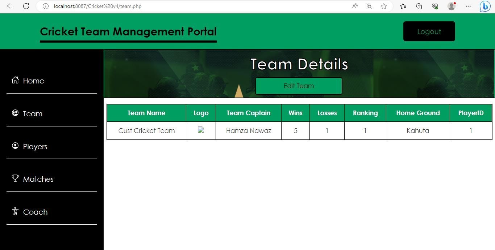
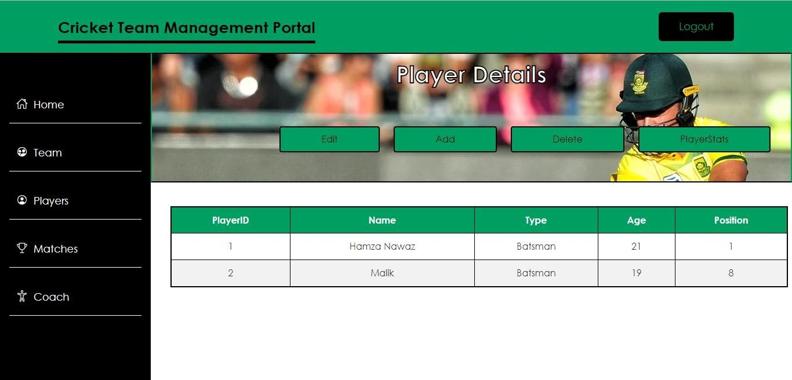
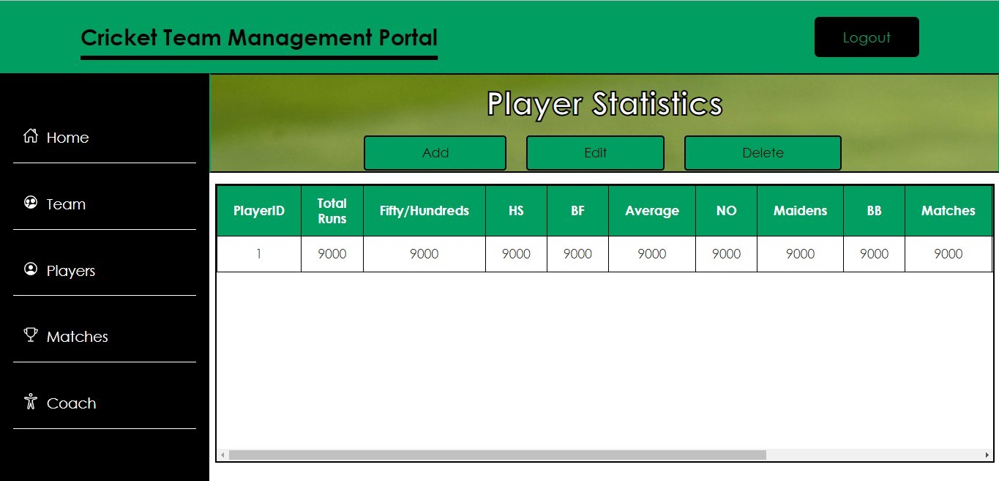
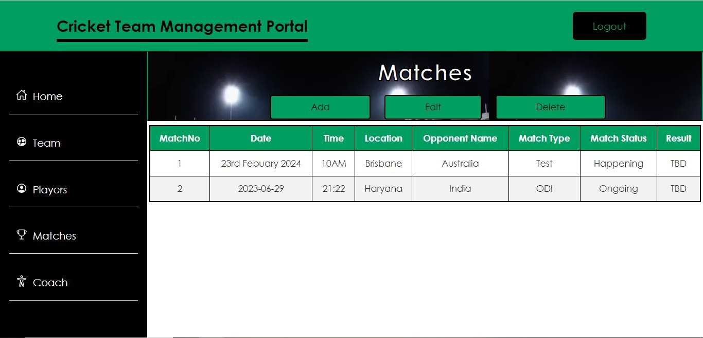
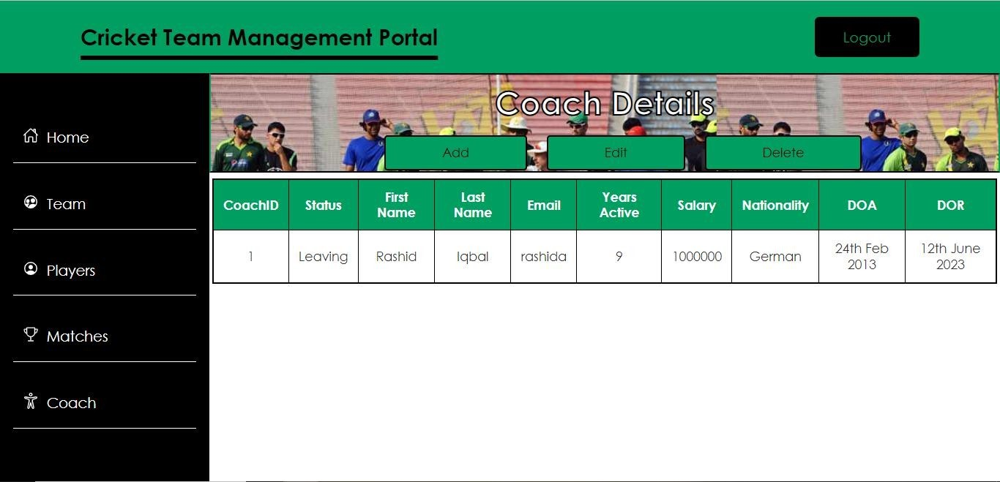

# 🏏 Cricket Team Management System

A database-driven web portal designed to streamline university cricket team management. The system enables administrators to manage players, matches, coaches, and team performance through a centralized dashboard.

## 📌 Features

- 🔐 Admin login system
- 🧑‍🤝‍🧑 Manage player profiles, positions, and performance stats
- 📆 Schedule matches and view match history
- 👨‍🏫 View and update coach information
- 📊 Record wins, losses, and team rankings
- ✏️ Edit, update, and delete entries dynamically

## 💻 Technologies Used

- **Frontend:** HTML, CSS
- **Backend:** PHP, MySQL
- **Database Management:** phpMyAdmin via XAMPP

## 📸 Screenshots

## 🗂️ Entity Relationship Overview

Key Entities:
- `Player` (Name, Age, Type, Position, Stats)
- `Match` (Opponent, Date, Result, Type)
- `Coach` (Status, Salary, Experience)
- `Team` (Captain, Logo, Ranking)

## 🚀 Getting Started

1. Clone the repo
2. Set up the database using the included SQL dump
3. Launch `index.php` in a local server (e.g. XAMPP)

## 🤝 Contributors

- Malik Hamza Nawaz  
- Javeria Khalid

